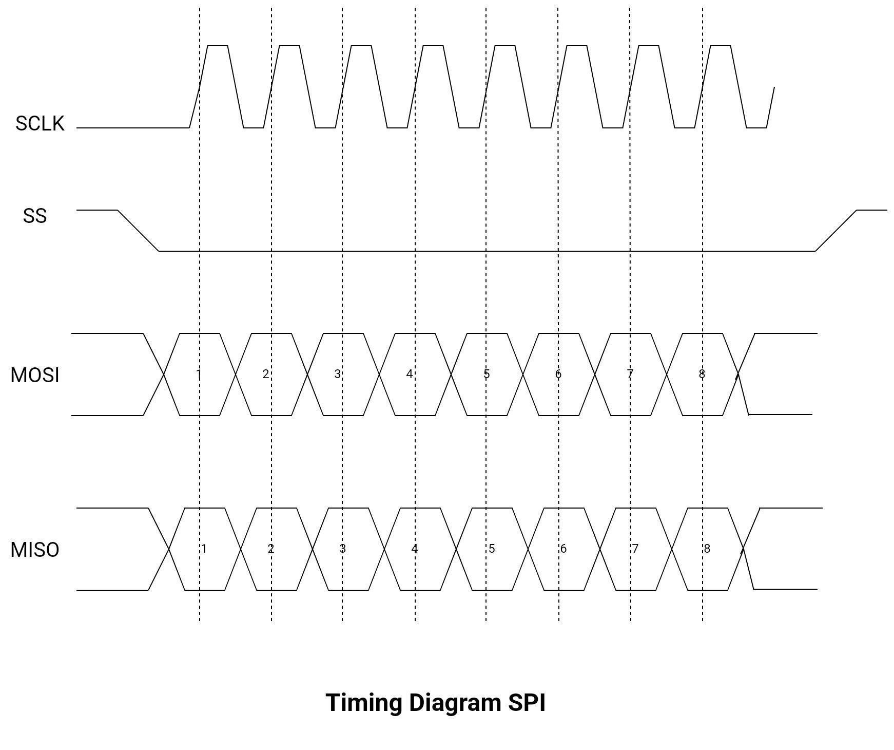

*   Power Management Integrated Circuits (PMICs) such as NH2D0245 PMIC .

*   cryptographic hardware accelerator in the ESP32 chip for encryption/decryption purposes.

*   Communucations modes:
        Simplex/ Half Duplex/ Full Duplex/ Dual Simplex/ 
*   Communication Protocols:
        SPI
            